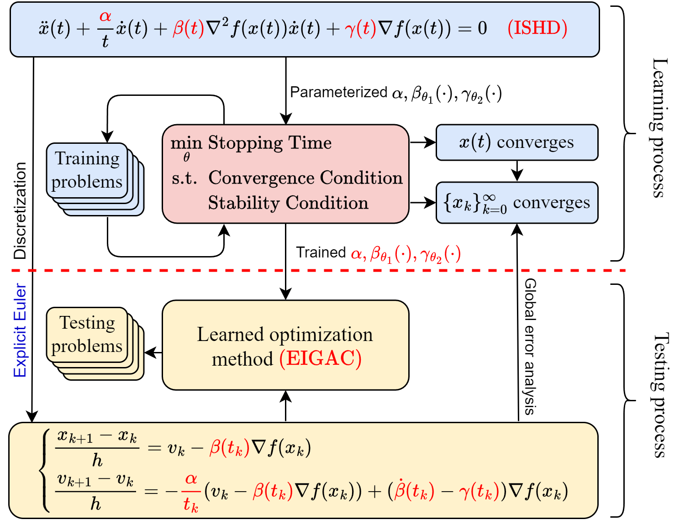

## O2O

**O2O: ODE-based learning to optimize (O2O)** is a comprehensive framework integrating the dynamical inertial Newton with asymptotic vanishing damping (DIN-AVD) equation for developing optimization methods. The pipeline of O2O is as follows:



The key ingredients of the proposed pipeline are:

* Stable discretization guarantee: Ensures the stable discretization of the ODE using the forward Euler scheme, consisting of a convergent condition and a stable condition.

* Learning to optimize framework: Utilizes a learning to optimize framework and a corresponding algorithm to find the optimal coefficients numerically.

* Stopping time: A measure of the efficiency of the algorithm generated by discretizing the ODE, generalizing complexity from discrete-time to continuous-time cases.

* Probability distribution of a parameterized function family: Defines the probability distribution by establishing equivalence with corresponding parameters.

* Penalty function method and stochastic optimization algorithms: Solves the stochastic optimization problem using these techniques.

* Conservative gradients: Derives conservative gradients of the stopping time and constraint functions to make the algorithm more robust and general.

* Convergence guarantees: Provides convergence guarantees for the training algorithm under the sufficient decrease assumption, using only the conservative gradients.

## Code Structure
```
	├── classic_optimizer # classic first-order methods for comparison
	│   
	├── dataset # datasets that are used to generate training and testing functions
	│   
	├── problem # contain the logistic regression and lpp norm minimization
	│   
	├── run.sh # scripts to run different experiments
	│   
	├── train.py # main script to train the model
	│   
	├── vector_field # vector fields for different ODEs
	│   
	└── visualization
		├── calc_complexity.py # calculate the averaged complexity of different algorithms for certain optimization problems
		├── calc_lastgrad.py # calculate the averaged gradient norm at last iteration of different algorithms for certain optimization problems
		├── compare_diff_epochs.py # compare the performance of the learned algorithm at different epochs
		├── generate_test_result.py # use the trained coefficents to generate test results
		├── table_complexity.py # organize the result generated by calc_complexity.py to a table (Table 4,5 in the paper)
		├── table_lastgrad.py # organize the result generated by calc_complexity.py to a table (Table 2,3 in the paper)
		├── visualize_diff_epochs.py # visualize the performance of the learned algorithm at different epochs (Fig. 4 in the paper)
		└── visualize_test_result.py # visualize the test results (Fig. 5,6,7 in the paper)
```

## Requirements
The environment dependencies are exported in the form of "requirements.yaml". For the most convenient installation of these environments, we highly recommend using conda.
```
conda env create -f requirements.yaml
```

## Quick Start

Run the following commands to train the model in different optimization tasks.
```
python train.py --problem lpp --dataset a5a --num_epoch 80 --pen_coeff 0.5
python train.py --problem lpp --dataset separable --num_epoch 15 --pen_coeff 0.5 --eps 1e-4
python train.py --problem lpp --dataset covtype --num_epoch 50 --pen_coeff 0.5 --batch_size 10240
python train.py --problem logistic --dataset covtype --num_epoch 50 --pen_coeff 0.5 --batch_size 10240
python train.py --problem lpp --dataset w3a --num_epoch 100 --pen_coeff 0.5
```

When the training process is finished in specific task, run the files in visualization to generate the test results and visualize them. The trained model and checkpoints are saved in the folder "saved_models" and "checkpoints" under "train_log". You need to specify the path of the model and checkpoints when run the visualization scripts.

## Usage
```
usage: python train.py [-h] [--problem {logistic,lpp}] [--dataset {mushrooms,a5a,w3a,phishing,separable,covtype}] [--pretrain]
                       [--num_epoch NUM_EPOCH] [--pen_coeff PEN_COEFF] [--lr LR] [--momentum MOMENTUM] [--batch_size BATCH_SIZE]
                       [--seed SEED] [--init_it INIT_IT] [--discrete_stepsize DISCRETE_STEPSIZE] [--eps EPS] [--l2 L2] [--p P]
                       [--optim {SGD,Adam}] [--threshold THRESHOLD]

Train the neural ODE using exact L1 penalty method.

optional arguments:
  -h, --help            show this help message and exit
  --problem {logistic,lpp}
                        Either logistic regression (default: without L2 regularization) or Lpp minimization (default: p=4)
  --dataset {mushrooms,a5a,w3a,phishing,separable,covtype}
                        Dataset use for training
  --pretrain            Load the pre-trained model or not
  --num_epoch NUM_EPOCH
                        The number of the training epoch
  --pen_coeff PEN_COEFF
                        The penalty coefficient of the L1 exact penalty term
  --lr LR               Learning rate of SGD
  --momentum MOMENTUM   Momentum coefficient of SGD
  --batch_size BATCH_SIZE
                        Batch size for training, default 1024, 10240 is recommended for covtype
  --seed SEED           Random seed for reproducing. 3407 is all you need
  --init_it INIT_IT     The number of iterate used to initialize the neural ODE, default is 300
  --discrete_stepsize DISCRETE_STEPSIZE
                        the step size used in discretization, default is 0.04
  --eps EPS             epsilon used to define the stopping time
  --l2 L2               the coefficient of the L2 regularization term in logistic regression
  --p P                 the exponential index of lpp minimization
  --optim {SGD,Adam}    the optimizer using in training
  --threshold THRESHOLD
                        the threshold using in constraints
```

## Experimental Results

We randomly generate 100 test functions for each problem, varying the instances from the dataset. The problems are specified by the dataset, batch size, and formulation (e.g., `lpp_a5a` for `a5a` dataset and $\ell_{p}^{p}$ minimization).

$$m(F_{\text{test}})=\frac{1}{|\mathscr{F}_{\text{test}}|}\sum_{f\in\mathscr{F}_{\text{test}}}\log\|\nabla f(x_{N})\|$$

For each method, we provide two statistics:
1. Averaged performance measure at the $N$-th iteration:
$$
m(F_{\text{test}})=\frac{1}{|\mathscr{F}_{\text{test}}|}\sum_{f\in\mathscr{F}_{\text{test}}}\log\|\nabla f(x_{N})\|
$$
2. Averaged complexity:
$$
N(F_{\text{test}})=\frac{1}{|\mathcal{F}_{\text{test}}|}\sum_{f\in\mathcal{F}_{\text{test}}}N(f,\varepsilon)
$$

The averaged performance measure with standard error is reported in Tables 1 and 2. INVD outperforms other methods with at least a magnitude in most cases.

| Method | mushrooms | a5a | w3a | phishing | covtype | separable |
|--------|-----------|-----|-----|----------|---------|-----------|
| GD     | -1.55     | -1.81 | -1.90 | -1.35 | -1.89 | -1.56 |
| NAG    | -3.37     | -3.11 | -3.26 | -3.01 | -3.07 | -3.66 |
| INVD(initial)   | -3.02     | -2.97 | -3.02 | -2.80 | -3.48 | -3.32 |
| EIGC   | -3.02     | -2.97 | -3.02 | -2.80 | -3.48 | -3.31 |
| INVD(learned)   | -4.83     | -4.38 | -4.46 | -4.82 | -4.37 | -5.49 |

*Table 1: Averaged performance measure in logistic regression problems.*

| Method | mushrooms | a5a | w3a | phishing | covtype | separable |
|--------|-----------|-----|-----|----------|---------|-----------|
| GD     | -2.49     | -2.79 | -3.18 | -2.36 | -2.65 | -2.95 |
| NAG    | -4.35     | -4.19 | -4.72 | -4.06 | -4.43 | -6.11 |
| INVD(initial)   | -4.16     | -3.99 | -4.66 | -4.37 | -4.47 | -6.15 |
| EIGC   | -4.16     | -4.05 | -4.66 | -4.37 | -4.51 | -6.14 |
| INVD(learned)   | -5.27     | -5.11 | -5.71 | -5.65 | -5.14 | -7.55 |

*Table 2: Averaged performance measure in* $\ell_{p}^{p}$ *minimization problems.*

The averaged complexity is presented in Tables 3 and 4. INVD consistently improves complexity, requiring only half the iterations of other methods in most problems.

| Method | mushrooms | a5a | w3a | phishing | covtype | separable |
|--------|-----------|-----|-----|----------|---------|-----------|
| GD     | 500.00    | 500.00 | 500.00 | 500.00 | 500.00 | 500.00 |
| NAG    | 500.00    | 500.00 | 500.00 | 500.00 | 500.00 | 424.71 |
| INVD(initial)   | 500.00    | 500.00 | 500.00 | 500.00 | 497.12 | 500.00 |
| EIGC   | 500.00    | 500.00 | 500.00 | 500.00 | 497.36 | 500.00 |
| INVD(learned)   | 153.48    | 227.32 | 216.42 | 182.15 | 237.88 | 11.49 |

*Table 3: Averaged complexity in logistic regression problems.*

| Method | mushrooms | a5a | w3a | phishing | covtype | separable |
|--------|-----------|-----|-----|----------|---------|-----------|
| GD     | 500.00    | 500.00 | 500.00 | 500.00 | 500.00 | 500.00 |
| NAG    | 183.77    | 211.87 | 92.61 | 252.43 | 167.31 | 52.15 |
| INVD(initial)   | 235.07    | 245.68 | 96.17 | 224.36 | 203.02 | 22.10 |
| EIGC   | 235.84    | 239.49 | 96.03 | 224.53 | 204.12 | 29.98 |
| INVD(learned)   | 93.12     | 122.16 | 50.93 | 85.57 | 109.15 | 11.00 |

*Table 4: Averaged complexity in* $\ell_{p}^{p}$ *minimization problems.*

## Summary of Dataset
The datasets used in our experiments are summarized in Table 1. In this table, $n$, $N_{\text{train}}$, and $N_{\text{test}}$ represent the dimension of the variable, the number of instances in the training dataset, and the number of instances in the test dataset, respectively.

| Dataset | $n$ | $N_{\text{train}}$ | $N_{\text{test}}$ | Separable | References |
|---------|-----|-------------------|------------------|-----------|------------|
| `a5a`   | $123$ | $6,414$         | $26,147$         | No        | [Dua and Graff, 2019] |
| `w3a`   | $300$ | $4,912$         | $44,837$         | No        | [Platt, 1998] |
| `mushrooms` | $112$ | $3,200$     | $4,924$          | Yes       | [Dua and Graff, 2019] |
| `covtype` | $54$ | $102,400$      | $478,612$        | No        | [Dua and Graff, 2019] |
| `phishing` | $68$ | $8,192$       | $2,863$          | No        | [Dua and Graff, 2019] |
| `separable` | $101$ | $20,480$   | $20,480$         | Yes       | [Wilson et al., 2019] |

*Table 1: A summary of the datasets used in experiments.*

All the datasets are designed for binary classification problems, and downloaded from the [LIBSVM data](https://www.csie.ntu.edu.tw/~cjlin/libsvmtools/datasets/), except the `separable` dataset. We construct the `separable` dataset using the code snippet downloaded from \[Wilson et al., 2019\]. They are generated by sampling $10240$ instances from $\mathcal{N}(\mu,I_{d})$ with label $b_{f}=1$ and $\mathcal{N}(\mu+\nu,I_{d})$ with label $b_{f}=0$, respectively. Here, $I_{d}\in\mathbb{R}^{d\times d}$ denotes the identity matrix. Each element of the vector $\mu\in\mathbb{R}^{d}$ is sampled from $\{0,1,\ldots,19\}$ uniformly, while the elements of the margin vector $\nu$ are drawn from $\{0,0.1,\ldots,0.9\}$ uniformly.

For each dataset, the label of each sample belongs to $\{0,1\}$. The value of each attribute are normalized to $[-1,1]$ by dividing the data-matrix $(a_1,a_2,\ldots,a_N)$ with the max absolute value of each attribute. The training and testing sets are pre-specified for `a5a` and `w3a`. For datasets that do not specify the testing set and training set, we divide them manually.

## Contact

We hope that the package is useful for your application. If you have any bug reports or comments, please feel free to email one of the toolbox authors:

- Zhonglin Xie, zlxie@pku.edu.cn
- Wotao Yin, wotao.yin@alibaba-inc.com
- Zaiwen Wen, wenzw@pku.edu.cn

## Reference
[Zhonglin Xie, Wotao Yin, Zaiwen Wen, O2O: ODE-based Learning to Optimize, arXiv:2307.00783, 2023.](https://arxiv.org/abs/2307.00783)

## License
GNU General Public License v3.0